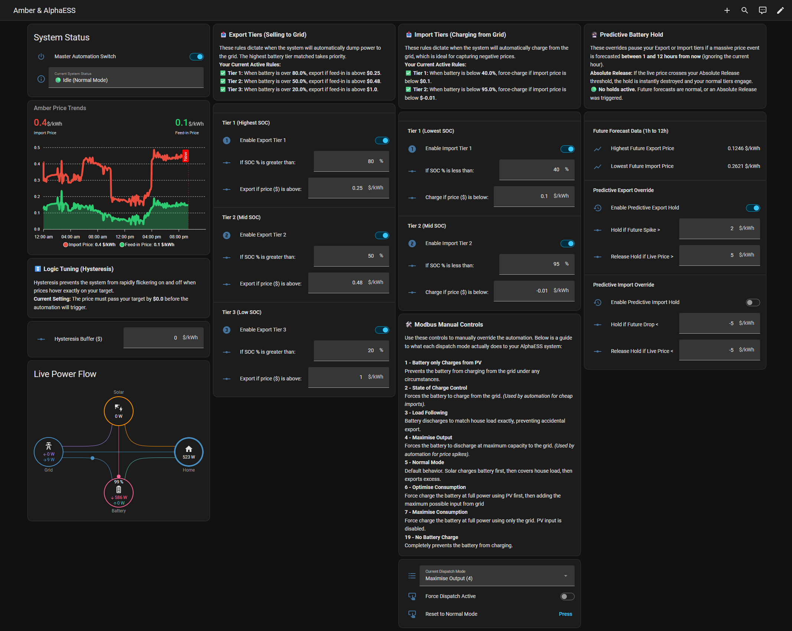

# HA Simple Energy Control

An automated energy management package for Home Assistant. This project controls an AlphaESS battery system using live and forecasted wholesale electricity prices from Amber Electric and solar generation forecasts from Solcast. It uses multi-tier State of Charge (SOC) rules, predictive 12-hour price forecasting, predictive solar soaking, negative price curtailment, and Modbus dispatch controls to optimise battery charging during low/negative-price periods and grid exporting during high-price events.

This can easily be adapted to work with other battery systems and energy providers — but in this state is set up for AlphaESS and Amber Electric.

## Features

* **Multi-Tier Export and Import Rules:** Define price thresholds that adjust dynamically based on current battery capacity. For example, configure the system to export at $0.20/kWh when SOC is >80%, but require $1.00/kWh when SOC is <30%.
* **Predictive Solar Soaking (Pre-Exporting):** Anticipates upcoming midday negative feed-in periods. When Solcast forecasts high solar generation that will exceed battery capacity during negative prices, the system pre-discharges the battery during the morning positive-price window down to a calculated target SOC, creating headroom to soak 100% of solar generation locally.
* **Negative Feed-in Price Curtailment:** Automatically halts exports and resets the inverter to Normal self-consumption mode when feed-in prices drop below your configured threshold (e.g. $\le \$0.00$/kWh), preventing costly negative export penalties.
* **Optimised Grid Charging:** When import prices drop below your threshold, the system activates AlphaESS **Optimise Consumption (Mode 6)** — which force-charges the battery at full power from the grid while PV output also contributes.
* **Predictive Holds:** Evaluates the next 12 hours of Amber Express price forecasts. If a significant price spike or drop is anticipated, the system temporarily suspends standard rules to preserve battery capacity for higher returns or lower charging costs.
* **Hysteresis & Safeguards:** Applies configurable buffers to price and SOC thresholds to prevent rapid mode toggling, with dedicated minimum SOC floors for both standard exporting and solar soak pre-exporting.
* **State-Based Notifications:** Triggers mobile push notifications exactly once per state transition, dynamically including context like target SoC, limits, and live pricing to reduce alert fatigue while maximizing visibility.
* **Custom Lovelace Dashboards:** Provides a consolidated `dashboard.yaml` interface for status tracking, live power flows, and solar soaking tuning. Also includes a dedicated `debug_dashboard.yaml` featuring an automation activity logbook, a logic "Why Was This Choice Made?" inspector, and interactive simulation recipes.

---



---

## Prerequisites

Before installing, ensure the following integrations and frontend components are already installed and configured:

### Integrations

1. **[Amber Express](https://github.com/hass-energy/amber-express) (≥ v2.0)**: A HACS custom integration for Amber Electric customers. Install via HACS by adding `https://github.com/hass-energy/amber-express` as a custom repository (Integration type). Configure with your Amber API token.

   > **Note:** This project requires the **Amber Express** custom integration, *not* the built-in Home Assistant Amber Electric integration. Amber Express provides enhanced polling, real-time WebSocket support, and the forecast attributes this package depends on.

   Provides:
   - `sensor.amber_express_<sitename>_general_price` — live import price
   - `sensor.amber_express_<sitename>_feed_in_price` — live feed-in price

2. **[Solcast Solar](https://github.com/BJReplay/ha-solcast-solar)**: A HACS integration providing solar generation forecasts.
   
   Provides:
   - `sensor.solcast_pv_forecast_forecast_remaining_today` (with `estimate10` or `pv_estimate10` conservative forecast attributes).

3. **[AlphaESS Modbus (hillviewlodge.ie/alphaess)](https://projects.hillviewlodge.ie/alphaess/)**: AlphaESS inverter configured for local Modbus TCP control. Provides the helper entities used to trigger dispatch modes:
   - `input_select.alphaess_helper_dispatch_mode`
   - `input_number.alphaess_helper_dispatch_duration`
   - `input_boolean.alphaess_helper_dispatch`
   - `input_button.alphaess_helper_dispatch_reset_full`
   - `sensor.alphaess_soc_battery`

4. **Home Energy Monitor**: Any sensor reporting site consumption in watts (e.g. a Shelly EM). Used by the dashboard only.

5. **Mobile App**: A `notify.mobile_app_<devicename>` notification service. Update the device name in the package file's USER CONFIGURATION section.

### Frontend Cards (HACS)

The dashboard requires these custom Lovelace cards:
* [`power-flow-card-plus`](https://github.com/flixlix/power-flow-card-plus)
* [`apexcharts-card`](https://github.com/RomRider/apexcharts-card)

---

## Installation

HA Simple Energy Control is distributed as a native **Home Assistant Package** — a single YAML file that is automatically loaded by HA alongside your main configuration. No custom integrations or Python code required.

### 1. Enable HA Packages (once only)

If you haven't already, add the following to your `configuration.yaml`:

```yaml
homeassistant:
  packages: !include_dir_named packages
```

This tells Home Assistant to automatically load any `.yaml` file placed in the `packages/` folder inside your HA config directory.

> **Already using packages?** If you already have a `packages:` block, use a named include to avoid conflicts:
> ```yaml
> homeassistant:
>   packages:
>     ha_simple_energy_control: !include packages/ha_simple_energy_control.yaml
> ```

### 2. Copy the Package File

Copy [`packages/ha_simple_energy_control.yaml`](packages/ha_simple_energy_control.yaml) from this repository into the `packages/` folder in your Home Assistant config directory.

### 3. Update the USER CONFIGURATION Section

Open `ha_simple_energy_control.yaml` and review the **USER CONFIGURATION** block near the top of the file. It lists every entity ID and service name that may need updating for your environment:

| What | Default value | Where to find yours |
|---|---|---|
| Import price sensor | `sensor.amber_express_home_general_price` | Settings → Devices & Services → Amber Express |
| Feed-in price sensor | `sensor.amber_express_home_feed_in_price` | Settings → Devices & Services → Amber Express |
| Solcast remaining sensor | `sensor.solcast_pv_forecast_forecast_remaining_today` | Settings → Devices & Services → Solcast Solar |
| Battery SOC sensor | `sensor.alphaess_soc_battery` | Settings → Devices & Services → Entities (Or in your battery integration) |
| Dispatch mode select | `input_select.alphaess_helper_dispatch_mode` | Settings → Devices & Services → Entities (Or in your battery integration) |
| Dispatch duration | `input_number.alphaess_helper_dispatch_duration` | Settings → Devices & Services → Entities (Or in your battery integration) |
| Dispatch trigger | `input_boolean.alphaess_helper_dispatch` | Settings → Devices & Services → Entities (Or in your battery integration) |
| Reset button | `input_button.alphaess_helper_dispatch_reset_full` | Settings → Devices & Services → Entities (Or in your battery integration) |
| Mobile notifications | `notify.mobile_app_phone` | Settings → Devices & Services → Mobile App |

### 4. Restart Home Assistant

Go to **Settings → System → Restart**. After restarting, all helpers, template sensors, and the automation will be active.

### 5. Configure the Dashboards (manual)

`dashboard.yaml` is a complete two-view dashboard for daily use, while `debug_dashboard.yaml` provides advanced diagnostics and simulation tools. They must be applied to the **root** of a dashboard — not to a single view inside one.

**Option A — New Dashboards (recommended):**
1. Go to **Settings → Dashboards** and click **Add Dashboard**.
2. Name it (e.g. *Energy Management*) and click **Create**. Open the new dashboard.
3. Enter Edit mode (pencil icon) → options menu (⋮) → **Raw Configuration Editor**.
4. **Replace** the entire default content with the contents of [`dashboard.yaml`](dashboard.yaml).
5. Click **Save**.
6. Repeat steps 1-5 for `debug_dashboard.yaml` (e.g. naming it *Energy Diagnostics*).

**Option B — Add views to an existing dashboard:**
1. Open your existing dashboard and enter Edit mode.
2. Open the Raw Configuration Editor (⋮ menu).
3. Under the existing `views:` key, append the two view blocks from `dashboard.yaml` (everything indented under `views:`).
4. Click **Save**.

---

## Usage Guide

### Predictive Solar Soaking

Wholesale electricity prices often plunge into negative territory during midday peak solar generation hours. When this occurs, exporting excess solar costs you money.

The **Predictive Solar Soak** feature solves this proactively:
1. It monitors Amber Express 12-hour feed-in price forecasts for upcoming negative intervals ($\le \$0.00$/kWh).
2. When a negative period is detected, it calculates expected excess solar yield using Solcast's conservative 10% forecast (`estimate10` / `pv_estimate10`) and your configured forecast weight.
3. It derives a **Soak Target SOC** indicating how much battery capacity must be made available to soak up solar generation during the negative pricing window.
4. During the morning positive-price window (when feed-in price $\ge$ Min Pre-Export Price), the system engages **Mode 4 (Maximise Output)** to pre-discharge the battery down to the target SOC.
5. Once discharged, the battery sits ready to absorb 100% of solar generation when negative prices hit.

### Negative Price Curtailment

If feed-in prices turn negative and the battery is full or unable to soak remaining solar generation, **Negative Price Curtailment** immediately blocks all export modes and commands the inverter to **Normal Mode (Mode 5)**. This prioritises self-consumption and battery charging while stopping forced grid export.

### Setting Tiers

The automation evaluates rules in descending priority from Tier 1 to Tier 3.

* **Exporting:** When feed-in price and SOC conditions are met, the automation activates **Maximise Output (Mode 4)**, discharging the battery to the grid at maximum power.
* **Importing:** When import prices drop below your threshold, the automation activates **Optimise Consumption (Mode 6)**. The battery force-charges at full power from the grid while PV output also contributes.

### Predictive Holds

When enabled, the system evaluates the `forecasts` attribute of the Amber Express price sensors 12 hours ahead. For example, if a Tier 1 rule is set to export at $0.30/kWh, but the forecast shows a $1.50/kWh peak later in the day, the system blocks immediate export to preserve battery capacity — provided the forecasted peak exceeds your configured predictive threshold.

### Dispatch Duration and Failsafe

Each time the automation sends a dispatch command to the inverter, it sets a **60-minute hardware duration** as a failsafe. To prevent the hardware timer from expiring during long export/import sessions, a **45-minute keep-alive** mechanism continuously refreshes the timer as long as conditions are met, minimising unnecessary Modbus writes while ensuring continuous operation. Additionally, a 15-minute `time_pattern` trigger acts as a supplementary safety check.

### Manual Overrides

The Master Automation Switch disables all automation logic. Manual controls at the bottom of the dashboard can then be used to select specific dispatch modes directly. Clicking **Reset to Normal Mode** returns the inverter to standard self-consumption.

---

## Dispatch Modes Reference

Only relevant for AlphaESS batteries connected via the hillviewlodge.ie/alphaess integration.

| Mode | Label | Behaviour |
|---|---|---|
| 4 | Maximise Output | Forces battery discharge; maximises power exported to the grid (used for price spikes and solar soak pre-exporting) |
| 5 | Normal | Standard self-consumption (the reset & curtailment target) |
| 6 | Optimise Consumption | Force-charges battery at full power from the grid; PV also contributes (used for cheap imports) |

---

## License

[MIT](LICENSE)
